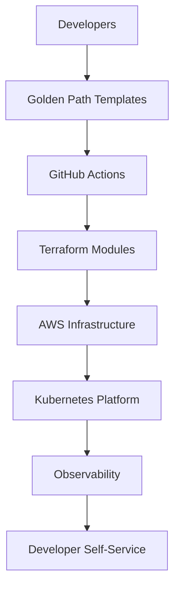
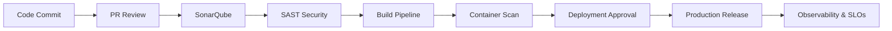
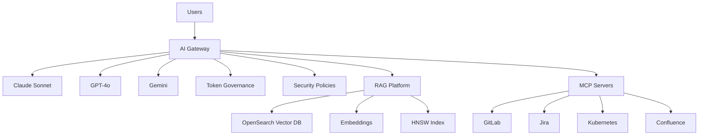
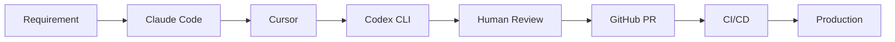
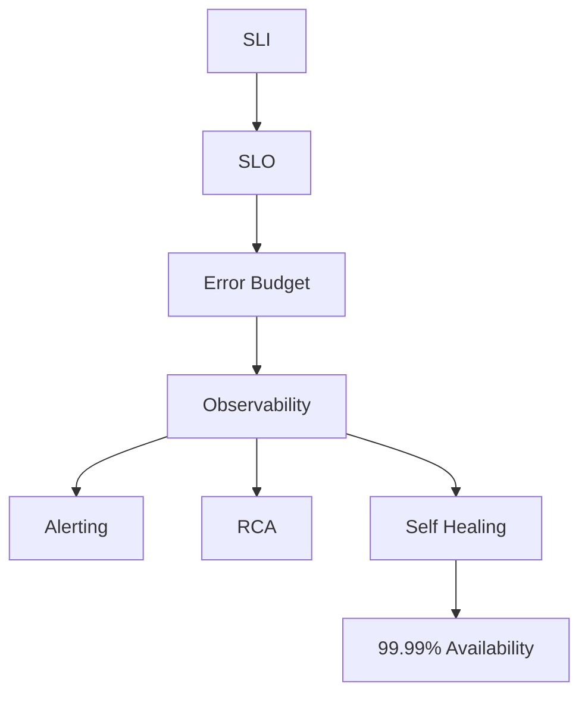

# Hi, I'm Vikash Jaiswal 👋

🚀 Platform Engineering | DevOps | AWS Cloud | Kubernetes | AI-Native Engineering

Powered by.

A modern Platform Engineer and DevOps professional who uses AI-native engineering practices to accelerate delivery, improve quality, implementation governance and automate repetitive tasks, while maintaining full ownership, review, and understanding of what goes into production.

---

## About Me

- 15+ years in IT & Engineering
- 7+ years in AWS, DevOps & Platform Engineering
- Expertise in Terraform, Kubernetes, GitOps, CI/CD, Observability & SRE
- AI-Native Development using Claude Code, Cursor, Codex CLI, Cline & MCP
- Building reusable platforms, Golden Paths & Developer Self-Service ecosystems
- Passionate about DevOps Governance, Engineering Metrics & Organizational Transformation

> "Engineering excellence comes from automation, governance, observability, and empowered developers."
>
> ## 🛠 Technology Stack

### Cloud & Platform
AWS • Kubernetes • EKS • Docker • Terraform • Helm • ArgoCD • GitOps

### DevOps
GitHub Actions • GitLab CI • Jenkins • SonarQube • Nexus • Artifactory

### Observability & SRE
Grafana • Prometheus • ELK • OpenSearch • Datadog • CloudWatch

### AI Engineering
Claude Code • Cursor • Codex CLI • Cline • MCP Servers • RAG • OpenSearch Vector DB

### Languages
Bash • Python (Automation) • Groovy • YAML • Terraform HCL

## 🏗 Platform Engineering Vision

## 🔐 Enterprise DevOps Governance Framework

## 🤖 AI Forge – Enterprise AI Control Plane

## 🚀 AI-Native Engineering Workflow

# 📚 Engineering Case Studies

### AI Forge – Enterprise AI Platform

Enterprise-grade GenAI platform architecture featuring:

- AI Gateway
- Multi-LLM Routing
- Token Governance
- OpenSearch Vector Search
- HNSW Indexing
- MCP Integrations
- LLM Observability
- Chargeback Models
- RAG Pipelines

Tech:

AWS • OpenSearch • Claude Code • MCP • Bedrock • Langfuse

### Enterprise DevOps Governance Framework

Built organizational DevOps governance models covering:

- DORA Metrics
- Engineering KPIs
- Quality Gates
- Security Shift Left
- CI/CD Standards
- Terraform Governance
- Release Governance
- Cloud Cost Optimization

Impact:

- Faster deployments
- Reduced failures
- Improved compliance
- Better engineering visibility

- ### Platform Engineering Enablement

Created reusable platform assets:

- Terraform Modules
- GitHub Actions Templates
- Kubernetes Standards
- Helm Charts
- Self-Service Documentation
- Golden Path Engineering

Outcome:

Developer self-service with reduced operational friction.

## ⚡ Site Reliability Engineering

## 🌱 Current Focus Areas

- Agentic AI Systems
- MCP Server Development
- AI Gateway Architectures
- Platform Engineering
- LLMOps
- SRE & Five Nines Reliability
- Developer Experience Engineering

- ## 🌍 Connect With Me

LinkedIn

Medium

GitHub

AWS Community

DevOps Community

---

> Platform Engineering • DevOps Governance • AI-Native Infrastructure • Developer Experience
