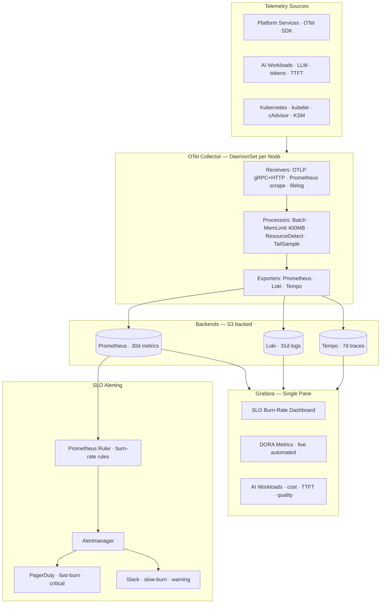

<div align="center">


<br/>

[](https://vikash-portfolio-alpha.vercel.app)
[](https://www.linkedin.com/in/linked2vikashjaiswal/)
[](https://medium.com/@vikash.jaiswal)
[](https://vikash-portfolio-alpha.vercel.app)

<br/>

| 🖥️ 19 EKS Clusters | 🌍 7 Global Regions | ⚙️ 100+ CI/CD Pipelines | 📈 99.99% Uptime SLA |
|:---:|:---:|:---:|:---:|

</div>

---

## 👤 About

I design and operate **enterprise-scale cloud and AI platforms** — 19 Kubernetes clusters across 7 AWS regions, 100+ automated pipelines, and multi-LLM AI systems built from scratch.

Currently **Lead DevOps Engineer at Devo Technology**, building AI FORGE (an Enterprise AI Agent OS on AWS Bedrock) and driving SRE governance, observability, and platform engineering at scale.

> *"Engineering excellence comes from SLO-based reliability, automated governance, and AI that knows your platform."*

📍 Noida / Gurgaon, India &nbsp;·&nbsp; **Available immediately** for Staff / Principal roles in Platform Engineering or AI Infrastructure

---

## 🛠️ Tech Stack

<div align="center">

**Cloud & Orchestration**

[](https://skillicons.dev)

**CI/CD & DevSecOps**

[](https://skillicons.dev)

**Languages & Frameworks**

[](https://skillicons.dev)

**Observability & AI**

[](https://skillicons.dev)

</div>

<div align="center">


</div>

---

## 🚀 Projects

### 🤖 [AI FORGE](https://github.com/vikas0486/AI-Forge) — Enterprise AI Agent Operating System

> Transforms Claude (AWS Bedrock) into a domain-expert platform engineer with persistent memory and zero-secret architecture


- **11 domain skill packs** — Kubernetes, Vault, Jenkins, MySQL, Jira, Prometheus, Maqui LINQ
- **Crescent Architecture** — credentials never enter AI context, injected at runtime via wrapper scripts
- **Structural deny-list** — 23 destructive operations blocked at shell level before AI execution
- **Result:** ~60% reduction in troubleshooting ramp-up · Zero credential leakage incidents

---

### 🔀 [forge-router](https://github.com/vikas0486/forge-router) — Multi-LLM AI Gateway & Router

> Zero-downtime AI infrastructure — automatic fallback across 10 providers, intent-based routing, embedded RAG


- **Intent routing** — sub-1ms regex: `chat / code / reasoning / agentic / summarization`
- **10 providers** — Groq · Claude · Gemini · OpenAI · Codex · Hermes · Sakana · Ollama (local/private)
- **Embedded RAG** — FAISS + SQLite + nomic-embed-text, auto-consolidation every 10 interactions
- **Result:** Zero full AI outages (was 2–3/week) · 40% cost reduction routing routine queries to Groq

---

### 📡 [forge-SRE](https://github.com/vikas0486/forge-SRE) — Production Observability & SRE Governance

> 21/24 governance deviation score audit → full remediation deployed in 6 weeks across 19 clusters


- **OTel Collector DaemonSet** — OTLP gRPC/HTTP · Prometheus scrape · filelog · tail_sampling (100% errors, 5% success)
- **SLO burn-rate alerting** — fast-burn (1h, 14×) → PagerDuty · slow-burn (6h, 6×) → Slack
- **DORA metrics** automated via ArgoCD webhooks + GitHub Actions → real-time Grafana
- **Result:** Alerts 200+/day → 12/day · MTTR 4.5h → 38min · 99.99% uptime for 18 consecutive months

---

### 🎬 [AI-ForgeStream](https://github.com/vikas0486/AI-ForgeStream) — Kubernetes-Native Media Processing

> Ephemeral Kubernetes Jobs replacing always-on EC2 — zero idle compute cost between transcodes


- **2-pass FFmpeg** loudness normalisation — EBU R128 / ITU-R BS.1770-4 compliant on every output
- **ABR ladder** — 1080p · 720p · 480p → HLS `master.m3u8` + structured `metrics.json` per job
- **FastAPI control plane** + K8s Job SDK · RBAC scoped to Job create/get/list/delete only
- **Result:** 100% idle EC2 cost → 0% · SSH manual → REST API · unlimited parallel capacity

---

### 🏗️ Production RAG System — Enterprise Knowledge Retrieval

> Full pipeline: S3 ingestion → OpenSearch Vector DB → Hybrid BM25 + Semantic Search → Multi-LLM


- Hybrid BM25 + semantic search · Cross-encoder reranking · AI Gateway with PII redaction
- LLM-as-a-Judge quality evaluation · Langfuse + OpenTelemetry observability throughout

---

### ⚡ EBS Auto-Remediation — Zero-Touch Storage Automation

> 2am on-call disk pages → fully automated · Slack human-in-the-loop approval


- CloudWatch → SNS → Lambda analysis → Slack `/expand` → `xfs_growfs` via SSM (no SSH)
- HMAC SHA256 verification · 25% growth cap · 6h cooldown · Full CloudTrail audit trail
- **Result:** ~8 on-call pages/month → 0 · 45min manual → 4min automated

---

## 🏗️ SRE Observability Architecture



---

## 📊 GitHub Stats

<div align="center">


<br/>


</div>

---

## 🏆 GitHub Trophies

<div align="center">

[](https://github.com/vikas0486)

</div>

---

## 📈 Contribution Activity

<div align="center">

[](https://github.com/vikas0486)

</div>

---

## 🎯 Current Focus

```text
🤖  Agentic AI Systems & Multi-LLM Orchestration (forge-router)
📡  SRE Governance & OTel Collector Pipelines at Scale (forge-SRE)
🏗️  Platform Engineering & Internal Developer Portals
🔐  AI Gateway — Rate Limiting · Circuit Breaker · PII Routing · Semantic Cache
📊  LLMOps · AI Observability · Token Cost Engineering (Langfuse)
☸️  Multi-region Kubernetes at Scale — 19 clusters · 7 AWS regions
```

---

<div align="center">

**Let's connect**

[](https://www.linkedin.com/in/linked2vikashjaiswal/)
[](https://vikash-portfolio-alpha.vercel.app)
[](https://medium.com/@vikash.jaiswal)
[](mailto:hsharma.gxi@gmail.com)

<br/>

*Platform Engineering · SRE · GenAI Infrastructure · DevSecOps · 16+ Years*

</div>
